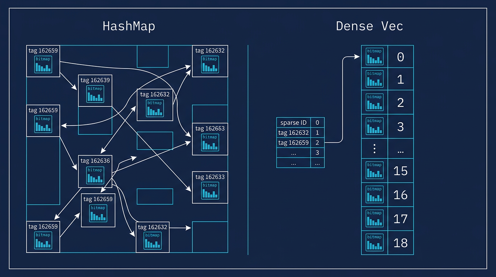

# Dense Tag Index: Why and How



## The Problem

Civitai has 31,248 distinct tags. Each tag has a roaring bitmap tracking which of the 107M images carry that tag. During loading, we build these bitmaps by processing 4.5 billion `(tag_id, image_id)` rows from the tags CSV.

The straightforward approach stores bitmaps in a `HashMap<u64, RoaringBitmap>`:

```
HashMap {
    162659 => RoaringBitmap { ... },    // "anime" tag
    5133   => RoaringBitmap { ... },    // "portrait" tag
    88201  => RoaringBitmap { ... },    // "landscape" tag
    ...31,248 entries
}
```

To insert a tag for an image, we do: `hashmap.entry(tag_id).or_default().insert(slot)`.

This works, but it has a hidden cost that shows up at scale.

## What a HashMap Actually Does

When you call `hashmap.entry(162659)`, the HashMap:

1. **Hashes the key** — runs the 64-bit tag_id through a hash function (SipHash or ahash)
2. **Probes the table** — jumps to the hash bucket, checks if the key matches, handles collisions
3. **Returns a reference** — to the RoaringBitmap at that position in the table's internal array

The hash + probe step touches memory at a **random location** in the table. With 31K entries, each entry is a RoaringBitmap that averages ~160 KB. The total HashMap working set is ~5 GB. Your CPU's L3 cache is 32 MB. Every lookup is a cache miss.

Worse: when 8 rayon workers each build their own HashMap and then **merge** them, the reduce step walks all 31K entries of one HashMap and OR's them into another. Two HashMaps = 10 GB of random memory access. The merge phase takes longer than the build phase.

## What a Dense Vec Does

The insight: we know all 31,248 tag IDs before we start building. We can assign each one a position in a flat array.

```
Lookup table (one-time build):
    162659 => 0
    5133   => 1
    88201  => 2
    ...

Dense Vec (contiguous in memory):
    [0] RoaringBitmap { ... }    // was tag 162659
    [1] RoaringBitmap { ... }    // was tag 5133
    [2] RoaringBitmap { ... }    // was tag 88201
    ...31,248 entries, packed tight
```

To insert: `vec[lookup[tag_id]].insert(slot)`. Array indexing. No hash, no probe, no collision handling. Just `base_pointer + index * size`.

## Why the Insert Speed Doesn't Change

The microbenchmark showed 1x insert speed — no improvement. Why?

Because the bottleneck isn't the lookup. It's the `RoaringBitmap::insert(slot)` call. Roaring bitmaps internally manage containers (arrays, bitsets, runs) that get split, promoted, and compacted as you insert. This container management dominates the per-insert cost. Whether you found the bitmap via hash or via array index, you still pay the same roaring insert cost.

Think of it like looking up a phone number vs making the phone call. We made the lookup faster, but the call takes just as long.

## Why the Merge Speed Improves 2.62x

The merge is different. When rayon's reduce phase combines two workers' results:

**HashMap merge** iterates one HashMap's entries and OR's each bitmap into the other:
```
for (tag_id, bitmap) in worker_b.drain() {
    worker_a.entry(tag_id)           // hash + probe (cache miss)
        .and_modify(|e| *e |= &bitmap)  // bitmap OR
        .or_insert(bitmap);
}
```

Every `.entry()` call jumps to a random memory location. With 31K entries across two 5 GB HashMaps, every access misses cache.

**Dense Vec merge** walks both arrays in lockstep:
```
for i in 0..31248 {
    vec_a[i] |= &vec_b[i];    // sequential access, prefetchable
}
```

This is a linear scan through contiguous memory. The CPU prefetcher sees the pattern and loads the next cache lines before you need them. Sequential access is 10-100x faster than random access on modern CPUs.

With 8 rayon workers producing 8 Vecs that get merged pairwise (8 -> 4 -> 2 -> 1), the merge phase happens 7 times. At 2.62x faster per merge, the total merge time drops from ~40 seconds to ~15 seconds.

## When to Use Dense Vec vs HashMap

| Characteristic | Use Dense Vec | Use HashMap |
|---|---|---|
| Distinct values known upfront | Yes | Not always |
| Number of distinct values | < 100K | Any |
| Values are sparse (ID gaps) | Fine (lookup table handles it) | Native |
| Values change during loading | No (rebuild lookup table) | Yes |
| Used in rayon fold+reduce | Big win on merge | Fine for small cardinality |

For BitDex: tagIds (31K values) and modelVersionIds (325K values) benefit. userId (748K values, but rarely merged in bulk) and low-cardinality fields (nsfwLevel with 7 values) don't need it.

## The Code

```rust
// One-time setup: scan tags to discover distinct IDs
let tag_index = DenseTagIndex::from_ids(all_tag_ids);

// Per-worker: allocate a Vec of empty bitmaps
let mut tag_vec = tag_index.new_bitmap_vec();

// Insert: array indexing, no hash
if let Some(idx) = tag_index.get(tag_id) {
    tag_vec[idx].insert(slot);
}

// Merge: sequential memory access
DenseTagIndex::merge_bitmap_vecs(&mut vec_a, &vec_b);

// Convert back to HashMap for engine consumption
let hashmap = tag_index.to_hashmap(tag_vec);
```

The engine still stores bitmaps in HashMaps internally (for query-time access patterns where random lookup is fine). The dense Vec is only used during the load phase where bulk insert + merge dominates.
